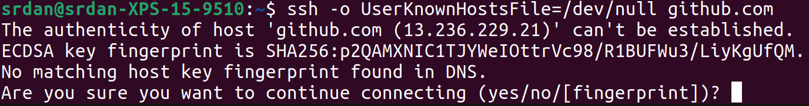

+++ 
draft = false
date = 2022-02-01T11:32:46+13:00
title = "Creating SSHFP records"
description = "How to setup SSHFP records to verify SSH fingerprints through DNS"
slug = ""
authors = ["Srđan Đukić"]
tags = ["ssh", "fingerprint", "verification", "authentication"]
categories = []
externalLink = ""
series = []
+++
# How to setup SSHFP records to verify SSH fingerprints

## What are SSHFP records and what problem are we trying to solve? 

NOTE: Feel free to skip this part if you know what [SSHFP records](https://en.wikipedia.com/wiki/SSHFP_record) are and want to get to the instructions

So, you might have noticed that every time you connect to a server over SSH you get a message like this:



The reasons for the message is that, unlike the CA system, the SSH protocol doesn't have a centralised "root of trust"
that forms the basis of authentication i.e. you have to figure out if the server you're talking to is actually the
server you're wanting to talk to.

What this means from a practical perspective is that the first time you connect to a server you need to check the hash
of it's public key to ensure that it is in fact the right server and not a .comery.

The general way to do this is to have a separate "channel" (e.g. email, secure chat, [sneaker
net](https://en.wikipedia.com/wiki/Sneakernet) etc...) that you receive the "trusted" public key fingerprint on.

The main issue with this is that there is a tendency to "click through" the message and just accept whatever hash is
there in the same way that certificate warnings inadvertently "trained" users for a long time to click through warnings.

SSHFP solves this problem by getting the SSH client to verify the hash presented by the server by comparing it to a DNS
record of the host of the SSHFP type.

NOTE: The DNS records themselves should be signed and verified using
[DNSSEC](https://en.wikipedia.com/wiki/Domain_Name_System_Security_Extensions) which we will leave for another article

## How to setup SSHFP records

Generating the records is fairly straight forward as it is built into the ssh-keygen command. It's simple enough to do
with the `-r` flag:

```
# ssh-keygen -r examplehost.example.com
```

This should generate output such as below:

```
examplehost.example.com IN SSHFP 1 1 1bd1755b811ba9c9a4416400e7b379d403ca8d11
examplehost.example.com IN SSHFP 1 2 54ec99231d0cf174e0d36c4ee691d55ec65c31c754e4348250d4162c148bde82
examplehost.example.com IN SSHFP 3 1 d926ddf5ecbfbcc7dca7d8b6b0fc4c5002c6d60a
examplehost.example.com IN SSHFP 3 2 407f3924ad32abe24d97594f2949718adf9d185a96312fcc9a885c20da7f7bd4
examplehost.example.com IN SSHFP 4 1 8d66e7ef5340329337e58e576c54468dd6246c99
examplehost.example.com IN SSHFP 4 2 591f54c3864c4509e4734651ed45365cecdec28a1edc6866212fdfac0fa83b4f
```

There are several records based on the fact that we want to represent the key using several algorithms (currently
supported are RSA, DSA, ECDSA,
Ed25519, Ed448) as well as the type of hash that was used (at the moment either SHA-1 or SHA-256)

Once we have these in place, we can then verify with:

```
$ dig SSHFP examplehost.example.com +short
1 1 A815236B92692195D9C34401CE9AC69837EA0470
4 1 284D04634247D0DEF54DA1A914F8C6636D834742
2 2 6689E96571F8E9BF70BAADECA51AA21323C493ED3243689D5CA2E9FC 5E728E6F
3 1 D06FB9244C6D5147CC13A14911637B975E70B07C
2 1 CFABAD89413AF3763836E71B1865DD6F374CC95A
1 2 C2A1562C4AC63A946D42373DEC440BF79F9220B8B383C28D5E2E7429 22374B17
3 2 0FCB57E5971EA68174431840F4A74261A25B016A22FD00E60EF99797 0DC1EBD4
4 2 DC2C591C620C9AB5652A863229E1726B39E6835C5CDAA8990F7D3096 584ACC90
```

after which we need to configure our SSH client to use DNS to verify the fingerprint by adding the following line to our
'.ssh/config' file:

```
VerifyHostKeyDNS yes
```

After adding this line, when connecting now we should see the following message when we connect to our host:

```
$ ssh foobar@examplehost.example.com
The authenticity of host 'examplehost.example.com (51.3.101.161)' can't be established.
ED25519 key fingerprint is SHA256:3CxZHGIMlrPlKoYyKeFyaznmg1xj2qiZD30wllhKzJA.
Matching host key fingerprint found in DNS.
Are you sure you want to continue connecting (yes/no/[fingerprint])?
```

As we can see, we are now informed by the SSH client that a matching host key was found in DNS, meaning that the
computer has compared the hashes for us!

If someone tries to trick us into connecting to the wrong server, we will get the following error message:
```
$ ssh foobar@examplehost.example.com
@@@@@@@@@@@@@@@@@@@@@@@@@@@@@@@@@@@@@@@@@@@@@@@@@@@@@@@@@@@
@    WARNING: REMOTE HOST IDENTIFICATION HAS CHANGED!     @
@@@@@@@@@@@@@@@@@@@@@@@@@@@@@@@@@@@@@@@@@@@@@@@@@@@@@@@@@@@
IT IS POSSIBLE THAT SOMEONE IS DOING SOMETHING NASTY!
Someone could be eavesdropping on you right now (man-in-the-middle attack)!
It is also possible that a host key has just been changed.
The fingerprint for the ED25519 key sent by the remote host is
SHA256:4udrktMzBVyoVYxZjDK9dL5i72golv7RB4Mj7DnIU74.
Please contact your system administrator.
Update the SSHFP RR in DNS with the new host key to get rid of this message.
The authenticity of host 'examplehost.example.com (51.3.101.161)' can't be established.
ED25519 key fingerprint is SHA256:4udrktMzBVyoVYxZjDK9dL5i72golv7RB4Mj7DnIU74.
No matching host key fingerprint found in DNS.
Are you sure you want to continue connecting (yes/no/[fingerprint])?
```

Do note that the client still prompts us and gives us the ability to accept the fingerprint and connect. However, it is
explicit in saying that the DNS does not match.
