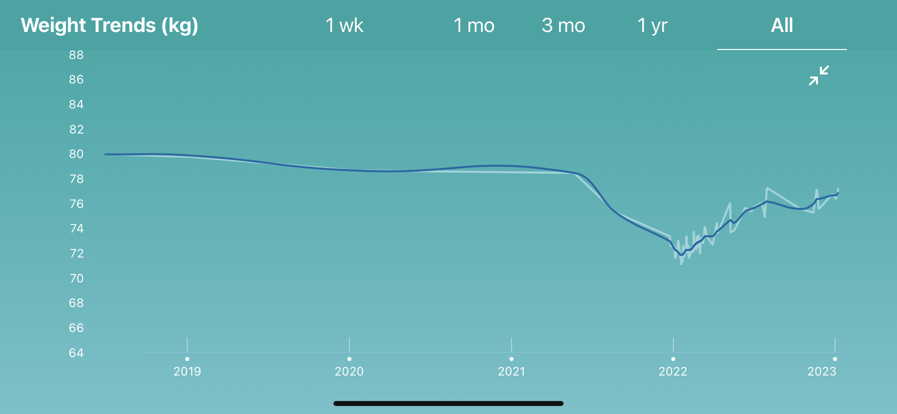

+++ 
draft = true
date = 2023-01-09T15:12:36+13:00
title = "Intermittent fasting"
description = "Intermittent fasting and how I do it"
slug = ""
authors = ["Srđan Đukić"]
tags = ["intermittent fasting", "weight loss", "ageing"]
categories = []
externalLink = ""
series = []
+++
# Intro
For about six or seven months in 2021 I realised that I was becoming quite unhealthy in terms of fitness and amount of
fat around my midriff. As a result I started doing a combination of intermittent fasting and exercise which seemed to
result in me losing 8-10kg in the course of about six months.

This post is about me trying to capture what I did and how I did it, mostly for my own future reference.

# Tracking

For tracking progress, I kept things quite simple and weighed myself when waking up, no clothes on and before having
anything to eat or drink.

# Intermittent Fasting

The main technique I used was Intermittent Fasting (after reading this and other articles on the Nerd Fitness website:
https://www.nerdfitness.com/blog/a-beginners-guide-to-intermittent-fasting/).

The rules I made for myself were:

* No eating in the morning (break the fast at 12pm midday)
* No eating after 8pm at night
* Drinking water and black coffee was allowed anytime
* Reduce the sugar intake
* Can eat anything you want during the non-fasting period

# Exercise

I incorporated two types of exercise:

* Bodyweight workouts (e.g. https://www.nerdfitness.com/blog/beginner-body-weight-workout-burn-fat-build-muscle/)
* Cardio (Cycling, running, swimming and rowing)

For the Cardio I got a gift from a relative for a membership to the "Conqueror" virtual challenges
(https://www.theconqueror.events/) and this was a great way to keep motivated, establish a routine and track progress
towards a goal.

I tried to do both a bodyweight workout in the morning (first thing after waking up) and then cardio in the evening
(after kids had gone to bed).

A lot of the days I only ended up doing one or the other unfortunately.
